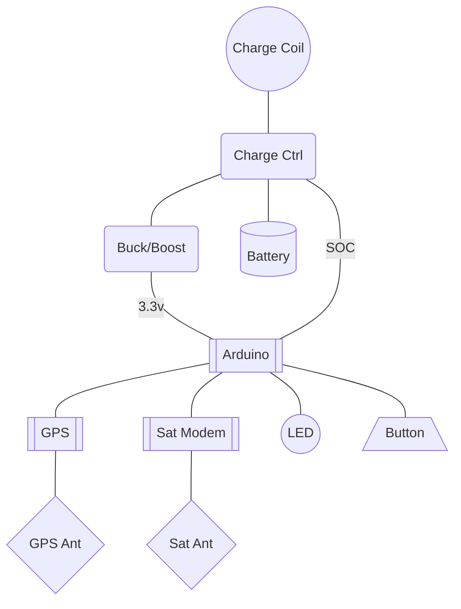

---
SSF Tracker Hardware Abstraction Diagram
---

```mermaid
flowchart TD
    arduino[[Arduino]] --- gps[[GPS]]
    gps --- gps_ant{GPS Ant}
    arduino --- sat_modem[[Sat Modem]]
    sat_modem --- sat_ant{Sat Ant}
    arduino --- led((LED))
    arduino --- button[/Button\]
    buck_boost(Buck/Boost) -- 3.3v --- arduino
    charge_ctrl(Charge Ctrl) --- buck_boost
    charge_ctrl --- battery[(Battery)]
    charge_ctrl -- SOC --- arduino
    charge_coil((Charge Coil)) --- charge_ctrl
```