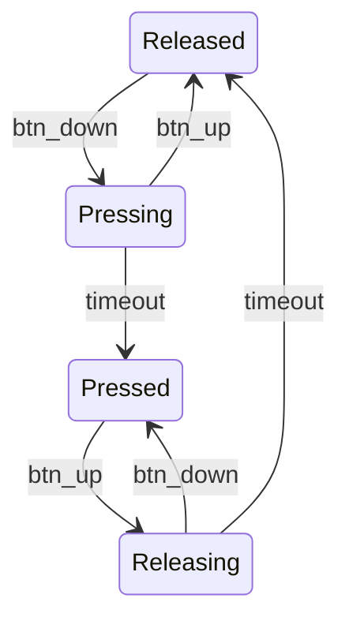

---
A state diagram for a simple button debounce
---

```mermaid
stateDiagram-v2
  Released --> Pressing : btn_down
  Pressing --> Released : btn_up
  Pressing --> Pressed : timeout
  Pressed --> Releasing : btn_up
  Releasing --> Pressed : btn_down
  Releasing --> Released : timeout   
```