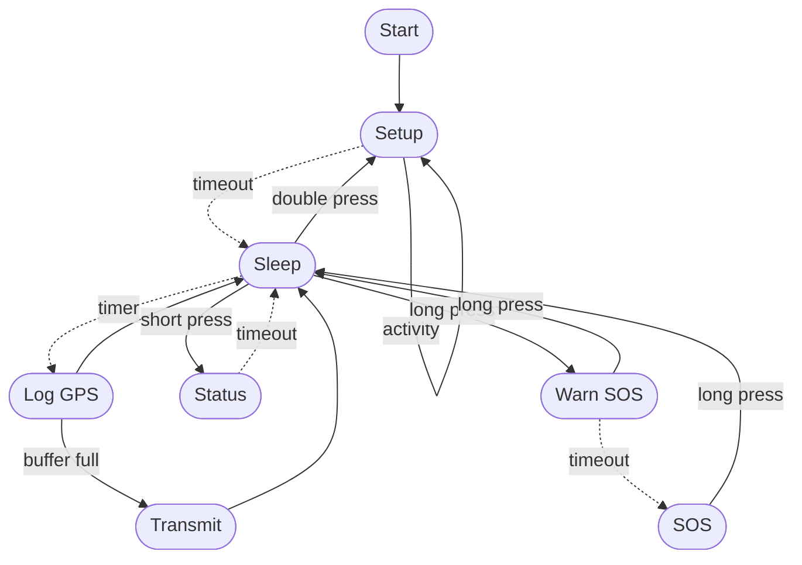
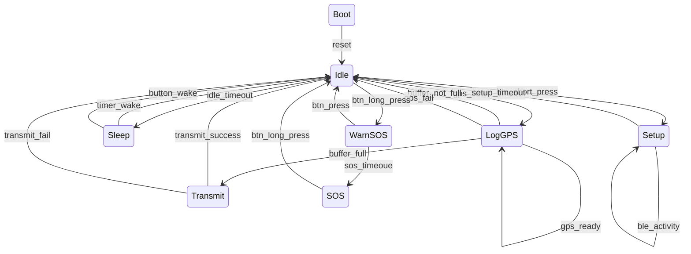
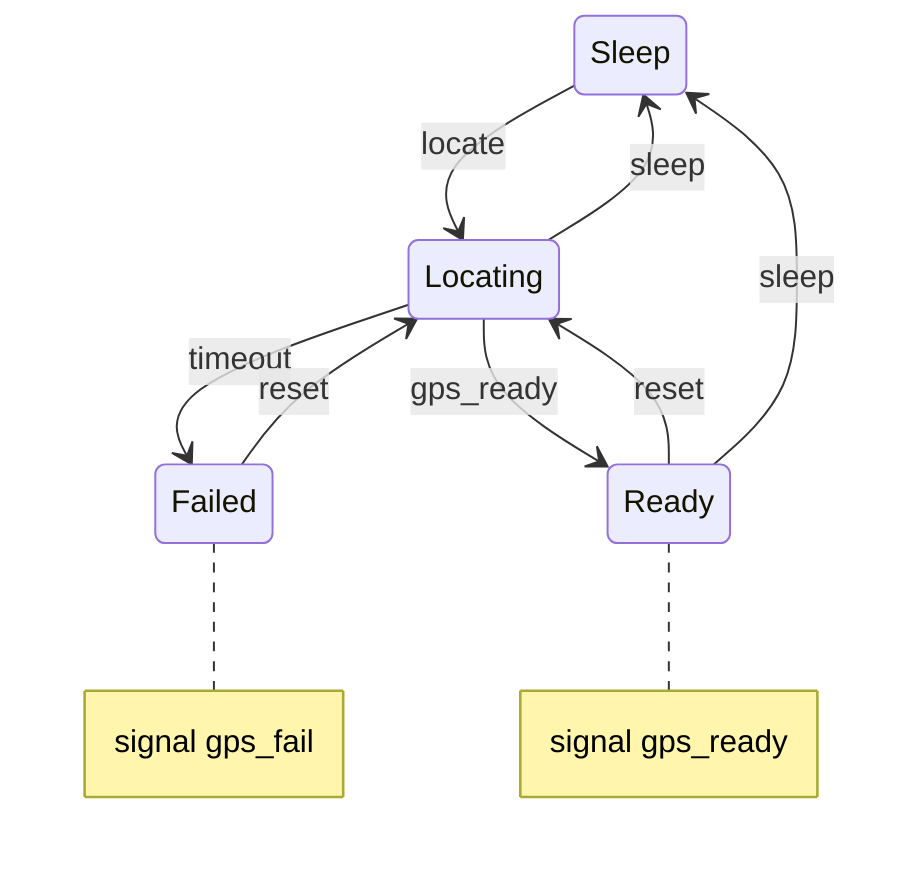
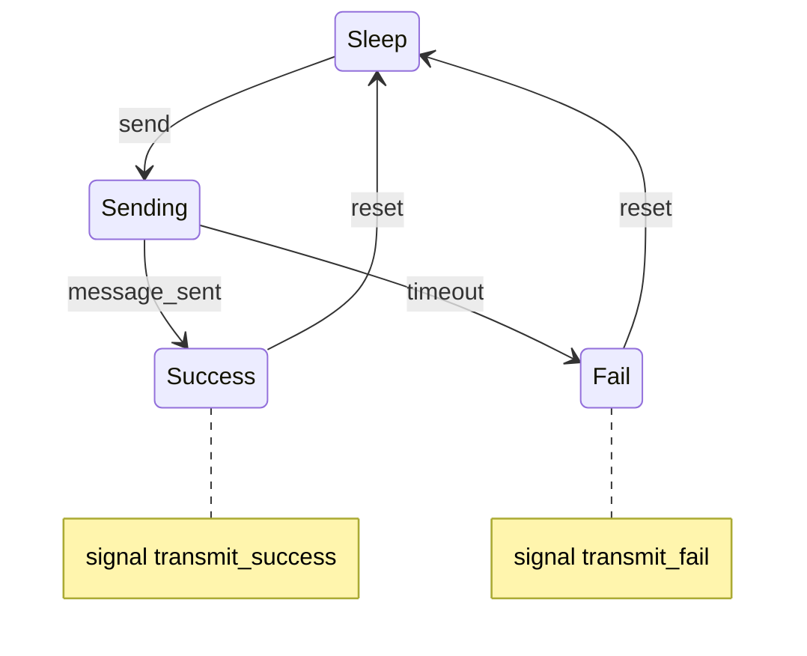
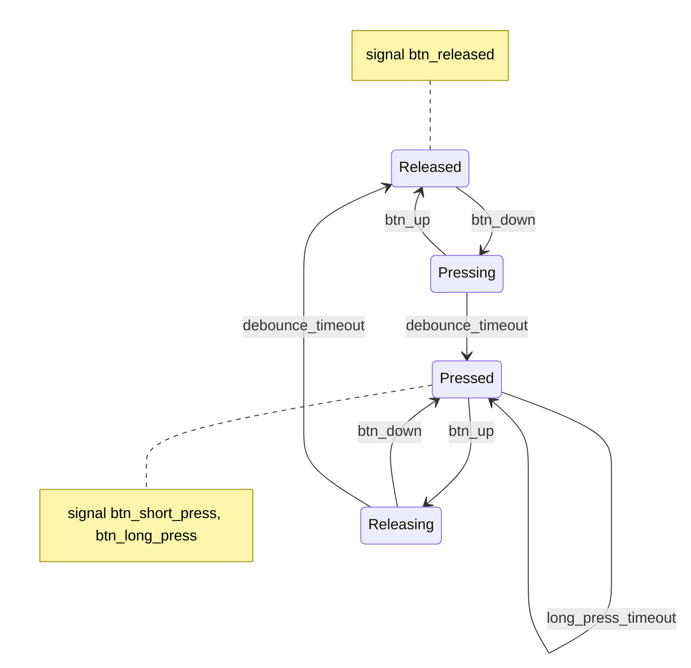
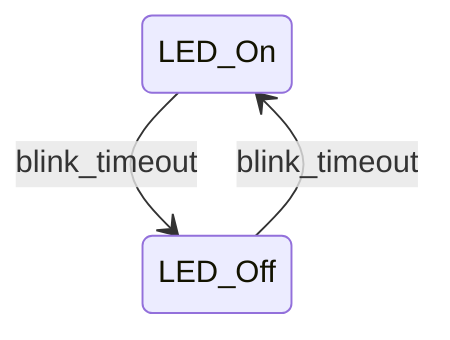

---
SSF Tracker State Transition Diagram
---
Abstract App states

```mermaid
flowchart TD
  boot([Start]) --> setup([Setup])
  setup -. timeout .-> sleep([Sleep])
  setup -- activity --> setup
  sleep -- double press --> setup
  sleep -. timer .-> log_gps([Log GPS])
  log_gps --> sleep
  log_gps -- buffer full --> transmit([Transmit])
  transmit --> sleep
  sleep -- short press --> status([Status])
  status -. timeout .-> sleep
  sleep -- long press --> warn_sos([Warn SOS])
  warn_sos -. timeout .-> sos([SOS])
  warn_sos -- long press --> sleep
  sos -- long press --> sleep
```

Main App State Diagram

```mermaid
stateDiagram-v2 
  Boot --> Idle : reset
  Idle --> LogGPS: gps_timer
  LogGPS --> LogGPS: gps_ready
  LogGPS --> Transmit: buffer_full
  LogGPS --> Idle: buffer_not_full
  LogGPS --> Idle: gps_fail
  Transmit --> Idle: transmit_success
  Transmit --> Idle : transmit_fail
  Idle --> Sleep: idle_timeout
  Sleep --> Idle: timer_wake
  Sleep --> Idle: button_wake
  Idle --> Setup: btn_short_press
  Setup --> Idle: setup_timeout
  Setup --> Setup: ble_activity
  Idle --> WarnSOS: btn_long_press
  WarnSOS --> Idle: btn_press
  WarnSOS --> SOS: sos_timeoue
  SOS --> Idle: btn_long_press
  
```

GPS Subsystem

```mermaid
stateDiagram-v2 
    Sleep --> Locating: locate
    Locating --> Ready: gps_ready
    Locating --> Failed: timeout
    note right of Failed : signal gps_fail
    Failed --> Locating: reset
    Ready --> Locating: reset
    Locating --> Sleep: sleep
    Ready --> Sleep: sleep
    note right of Ready : signal gps_ready

```

SatCom Subsystem

```mermaid
stateDiagram-v2 
    Sleep --> Sending: send
    Sending --> Success: message_sent
    note right of Success : signal transmit_success
    Sending --> Fail: timeout
    note right of Fail : signal transmit_fail
    Success --> Sleep: reset
    Fail --> Sleep: reset
```

Button Subsystem

```mermaid
stateDiagram-v2
  Released --> Pressing : btn_down
  Pressing --> Released : btn_up
  Pressing --> Pressed : debounce_timeout
  note right of Pressed : signal btn_short_press, btn_long_press
  Pressed --> Releasing : btn_up
  Releasing --> Pressed : btn_down
  Releasing --> Released : debounce_timeout   
  note left of Released : signal btn_released
  Pressed --> Pressed : long_press_timeout
```

Indicator Subsystem

```mermaid
stateDiagram-v2
  LED_On --> LED_Off : blink_timeout
  LED_Off --> LED_On : blink_timeout
```