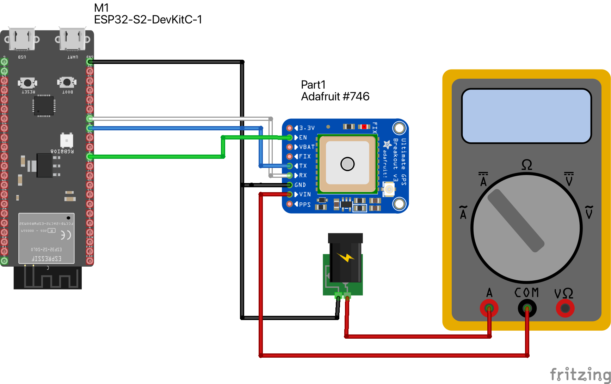

# Test scenarios for low power GPS logging using micropython 

Board: ESP32-S3 DevKit C with micropython installed
GPS module: Adafruit Ultimate GPS

## Wiring

* Connect GPS `TX` and `RX`to pins 9 and 10
* GPS power from `3V3`
* CR2032 battery installed
* `EN` Pin from GPS to GPIO output pin 8

## Test Cases

### Test 1: Verify setup
  * Connect to the GPS and make sure that it can fix a location

### Test 2: Turn the GPS on and off 
  * Turn the GPS on and off with the EN pin

### Test 3: Measure warm start
  * Measure time to warm start after GPS is off for 1, 2, 5, 10 minutes

### Test 4: Measure cold start
  * Measure time to cold start after GPS is off for > 4 hours

### Test 5: LOCUS logging
  * See if backup mode really only uses 7ua while sleeping

### Test notes

#### Test setup
I used my digital multimeter to measure current draw from the gps module.  I connect it in series on the high side. 
At first I was powering the gps fro the `3V3` pin on the microcontroller, but when I put the multimeter in between 
them the gps starting spitting out garbage on the serial line, so I switched it to power the GPS separately with 4V
from my desktop power supply (making sure to have a common ground!)

After running the gps through all the different modes, I measured the following  

### Power use
| Mode | Current | Notes |
| ---- | ------- | ----- |
| Active | ~30ma | variable because of the flashing LED |
| EN pin low | 300 ua | |
| Standby mode | 1.65 ma | the sleep cycle using periodic standby mode |
| Backup mode | 1.65 ma | the sleep cycle using periodic backup mode |
| VBATT | 7 ua | Hard to measure, but this is what the spec says and seems to be accurate |

Notes
* I pulled the EN pin low using a GPIO pin and by just connecting it to ground.  Both methods gave teh same result
